# ExecuTorch MLOps Haptic Mat — Quantized Person Detection Pipeline

An end-to-end **MLOps framework** for deploying **quantized person-detection models** on an **Android-based haptic mat system** using **STM32 pressure sensing** and **ExecuTorch**.

This repo extends the original ExecuTorch MobileNet demo with a production-ready pipeline:  
**Python PTQ + MLflow + MinIO + Jenkins CI/CD + Android ExecuTorch inference**.

---

## Project Title  
**MLOps Framework for Quantized Person Detection Models in Android-Based Haptic Mat Systems with STM32 Pressure Sensing**

```mermaid
flowchart LR

    %% ========== COMPONENTS ==========
    Script["Python Script<br/>(Model Dev & Log)"]
    MLflow["MLflow Tracking Server"]
    MySQL["MySQL Backend Store"]
    Minio["MinIO Object Storage"]
    Jenkins["Jenkins CI/CD Pipeline"]
    Android["Android App<br/>ExecuTorch Runtime"]

    %% ========== PIPELINES ==========

    %% Script → MLflow
    Script -->|"1. Train, Quantize & Log<br/>(Artifacts & Metrics)"| MLflow

    %% MLflow → Backend Stores
    MLflow -->|"runs, params, metrics"| MySQL
    MLflow -->|"artifacts<br/>(Staging Bucket)"| Minio

    %% Jenkins → MLflow → MinIO
    Jenkins -->|"2. Trigger & Fetch latest run"| MLflow
    Jenkins -->|"Download artifacts<br/>(from Staging)"| Minio
    Jenkins -->|"3. SHA-256 Verification"| Jenkins
    Jenkins -->|"4. Promote to Production<br/>(model.pte + latest.json)"| Minio

    %% Android App → MinIO
    Android -->|"5. Check for Updates<br/>(GET latest.json)"| Minio
    Android -->|"Download new model.pte<br/>(if SHA mismatch)"| Minio
    Android -->|"6. On-device Inference<br/>ExecuTorch XNNPACK"| Android

    %% STYLES
    classDef server fill:#e7f0ff,stroke:#4a90e2,stroke-width:1px;
    classDef storage fill:#fff7e6,stroke:#e6a500,stroke-width:1px;
    classDef mobile fill:#e6fff2,stroke:#00a86b,stroke-width:1px;
    classDef script fill:#f6f8fa,stroke:#999,stroke-width:1px;
    classDef jenkins fill:#ffecec,stroke:#ff5757,stroke-width:1px;

    class Script script;
    class MLflow server;
    class Jenkins jenkins;
    class MySQL,Minio storage;
    class Android mobile;
```



### Tech Stack

| Category | Technologies |
| :--- | :--- |
| **MLOps Core** | Docker, MLflow, MinIO (S3 compatible), Jenkins, MySQL |
| **Model Development** | Python, PyTorch, Torchvision |
| **Quantization & Edge** | ExecuTorch, XNNPACK (CPU Backend), PTQ (Post-Training Quantization) |
| **Mobile Development** | Android (Kotlin), Jetpack Compose |
| **Hardware** | STM32 Pressure Sensors (Data Source), Android Device (Inference) |

---

## 1. Model Development Process

All model-related work is organized under the `model_development/` directory.

### 1.1. Data Collection
Data is collected from the Seroton haptic mat via Bluetooth Low Energy (BLE) using custom Python scripts (`model_development/data_collection/`). The raw pressure sensor data is processed into CSV format for training.

### 1.2. Model Training (PyTorch)
A **MobileNetV2** model is trained using PyTorch on the collected dataset. The training scripts handle data loading, augmentation, and the training loop.

### 1.3. Quantization (PTQ) & Optimization
To enable efficient running on mobile CPUs, the trained FP32 model is converted to **INT8** using **Post-Training Quantization (PTQ)**.
The script `mv2_xnnpack_build.py` handles this process:
1.  Loads the PyTorch model.
2.  Applies PTQ with calibration data.
3.  Exports the model to the **ExecuTorch (`.pte`)** format, optimized for the **XNNPACK** backend.

### 1.4. Benchmarking
We use a custom Android benchmarking tool (under `model_development/benchmarking_tool/`) to measure the on-device performance (latency, memory) of different quantization strategies before deploying them to the main app.

## 2. MLOps Workflow & Proof of Concept

This section describes the actual execution of the automated pipeline in our live environment. All MLOps infrastructure code is located in the `mlops_infra/` directory.

### Phase 1: Foundation & Tracking (Python & MLflow)
The process is initiated by the `log_model_to_mlflow.py` script, which acts as the secure entry point for trained models. This script performs the following actions:
1.  Loads the quantized `.pte` model file.
2.  Calculates a **SHA-256 hash** of the model file for security and integrity verification.
3.  Logs the model artifact, its SHA-256 hash, and key performance metrics to the MLflow Tracking Server.

Upon successful logging, the raw model artifacts are automatically stored in the **Staging Bucket** (`mlflow-artifacts`) within the MinIO object storage.

### Phase 2: CI/CD Pipeline & Promotion (Jenkins)
A Jenkins CI/CD pipeline, defined in `deployment_pipeline.groovy`, is triggered to handle the model promotion process. The pipeline executes the following steps automatically:
1.  Fetches the artifacts of the latest successful run from the MinIO Staging bucket.
2.  Performs a critical **SHA-256 verification** by recalculating the hash of the downloaded artifact and comparing it against the record in MLflow.
3.  If the verification is successful, it promotes the model by uploading the verified `.pte` file and a newly generated `latest.json` manifest file to the **Production Bucket** (`mlops-test`) in MinIO.

### Phase 3: Edge Deployment & Over-The-Air (OTA) Update (Android)
The Android application integrates the **ExecuTorch runtime** and implements an intelligent Over-The-Air (OTA) update mechanism to ensure the device always runs the latest validated model without requiring a full app re-installation.

The update process on the device works as follows:
1.  The app periodically polls the `latest.json` manifest file situated in the MinIO Production Bucket.
2.  It reads the SHA-256 hash of the latest available model from the manifest.
3.  It compares this remote hash with the hash of the model currently running locally on the device.
4.  If the hashes differ, the app automatically downloads the new `.pte` model file from the Production Bucket, replaces the old model, and seamlessly loads the new one for inference.

---

## 3. Android Application Integration

The Android application, located in the `android_app/` directory, is built using Kotlin and Jetpack Compose. It is designed to integrate the **ExecuTorch runtime** seamlessly, enabling the loading and execution of quantized `.pte` models efficiently on the device's CPU using the **XNNPACK backend**.

### Intelligent Over-The-Air (OTA) Update Mechanism
A key feature of the application is its ability to perform intelligent OTA updates, decoupling model releases from application updates. The mechanism works as follows:

1.  **Check for Updates:** Upon startup or trigger, the app polls the `latest.json` manifest file located in the MinIO Production Bucket.
2.  **Verify Hash:** It reads the SHA-256 hash of the latest available model from the manifest and compares it with the hash of the currently loaded local model.
3.  **Conditional Download:**
    * If the hashes match, the app uses the existing local model, saving bandwidth and time.
    * If the hashes differ, the app automatically downloads the new `.pte` model file from MinIO, verifies its integrity, replaces the old model, and loads the new one for inference.

### Performance & Inference
Once a valid model is loaded, the application performs real-time inference on sensor data coming from the haptic mat.

**Key Performance Metrics (Tested on Samsung Device):**
* **Inference Time:** ⚡ Average of **~5ms** per inference, suitable for real-time applications.
* **Model Size:** 📦 **~9MB** (INT8 Quantized MobileNetV2), ensuring minimal storage footprint.
* **Backend:** 🚀 **XNNPACK**, providing highly optimized execution on mobile CPUs.
* **Validation:** 📊 The application verifies that the model output shape is correct ([1, 1000] for ImageNet classification) to ensure reliable results.

---

## 4. How to Run the Pipeline

Follow these steps to stand up the entire infrastructure and run the end-to-end pipeline locally.

**Prerequisites:**
* Docker Desktop (installed and running)
* Python 3.8+ (with virtual environment recommended)
* Android Studio (for running the mobile app)

### Step 1: Start the MLOps Infrastructure (Docker)
Spin up the backend services (MLflow, MinIO, Jenkins, MySQL).
```bash
cd mlops_infra
docker compose up -d
```
MLflow: http://localhost:Configure Your Port

MinIO: http://localhost:Configure Your Port

Jenkins: http://localhost:Configure Your Port

### Step 2: Train/Quantize & Log Model (Python)
Install requirements and run the script that simulates model training completion and logs the artifact to MLflow.
```bash
cd ../model_development/scripts
# (Ensure requirements.txt dependencies are installed first)
python log_model_to_mlflow.py
```
Check the MLflow dashboard to confirm the run is logged and artifacts are stored.

### Step 3: Trigger CI/CD Deployment (Jenkins)
Access Jenkins at http://localhost:8080.

Create a new pipeline job pointing to the deployment_pipeline.groovy file in the root directory.

Build the job. Watch the logs as it downloads, verifies (SHA-256), and promotes the model to the MinIO Production bucket.
### Step 4: Run the Android App
Open the android_app/ project in Android Studio.

Build and run the app on a physical device or emulator.

Tap the "Load Model" button. The app will check MinIO for updates, download the model if needed, and begin real-time inference.

## 5. Conclusion & Future Work

This project successfully established a robust, end-to-end MLOps framework that automates the delivery of optimized AI models to edge devices. By integrating PyTorch quantization, MLflow tracking, Jenkins CI/CD, and ExecuTorch runtime, we solved key edge AI challenges regarding latency, privacy, and update agility.

**Future Work:**
* **Enhanced Security:** Implement a **FastAPI Middleware Layer** acting as an API Gateway between the Android app and MinIO to enforce stricter authentication, authorization, and rate limiting for OTA requests.
* **Federated Learning:** Explore automating a retraining pipeline based on anonymized data collected from edge devices to improve model accuracy over time.

---

## 6. References

* **Advanced Science:** [Smart Haptic Mat System](https://advanced.onlinelibrary.wiley.com/doi/10.1002/advs.202402461)
* **MobileNetV2:** [Inverted Residuals and Linear Bottlenecks](https://arxiv.org/abs/1712.05877)
* **ExecuTorch:** [PyTorch Edge AI framework Documentation](https://pytorch.org/executorch)
* **XNNPACK:** [High-efficiency floating-point neural network inference operators Library](https://github.com/google/XNNPACK)
* **Vulkan:** [Cross-platform 3D graphics and computing API](https://www.vulkan.org/)
* Ignatov, A., et al. (2018). AI Benchmark: Running Deep Neural Networks on Android Smartphones. *Proceedings of the European Conference on Computer Vision (ECCV) Workshops*.
* Zhang, Q., et al. (2022). A Comprehensive Benchmark of Deep Learning Libraries on Mobile Devices. *Proceedings of the ACM Web Conference 2022*.
* Zhou, Z., et al. (2019). Edge Intelligence: Paving the Last Mile of Artificial Intelligence with Edge Computing. *Proceedings of the IEEE*, 107(8), 1738-1762.
* Jacob, B., et al. (2018). Quantization and Training of Neural Networks for Efficient Integer-Arithmetic-Only Inference. *Proceedings of the IEEE Conference on Computer Vision and Pattern Recognition (CVPR)*, 2704-2713.

